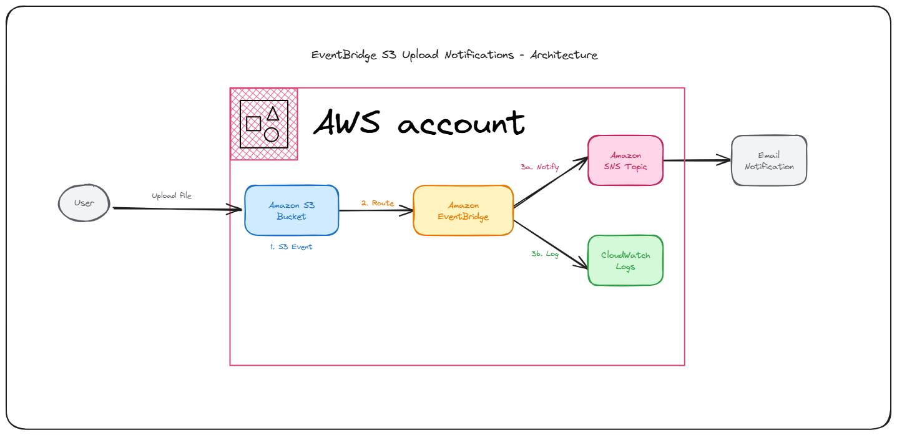

# EventBridge S3 Upload Notifications

This project demonstrates EventBridge by creating something practical - getting notified when files are uploaded to S3. It's a great way to understand event-driven architecture.

## Architecture

## What This Does

Upload a file to S3, and you'll automatically get:
- Email notification with file details
- Event logged to CloudWatch for monitoring
- Shows how one event can trigger multiple actions

## Why EventBridge?

While the direct S3 → SNS approach works, EventBridge is much more powerful. You can route one event to multiple services, filter events, and build complex workflows. Plus it's what most companies use in production.

## Key Learning

The important insight is understanding S3 has two different notification systems:
- **Event notifications** - sends directly to SNS/SQS/Lambda (simple but limited)
- **EventBridge integration** - sends to EventBridge first, then you can route anywhere (powerful)

Understanding this difference opens up much more sophisticated architectures.

## Setup Options

This project includes two ways to set this up:

**AWS-CONSOLE-SETUP.md** - For those who prefer clicking through the console (recommended for first time)

**COMPLETE-WALKTHROUGH.md** - For those who want to use CLI commands (better for automation later)

Both approaches work the same way, just different interfaces.

## Real Uses

This pattern shows up everywhere:
- File processing pipelines (scan uploaded files, convert formats, etc.)
- Backup monitoring (know when backups complete)
- Content workflows (notify teams when new content arrives)
- Compliance logging (audit trail for all file operations)

## Getting Started

Pick whichever setup guide matches your preference. The console approach is more visual, CLI is faster once you know what you're doing.

After setup, just upload any file to your S3 bucket and watch the magic happen!